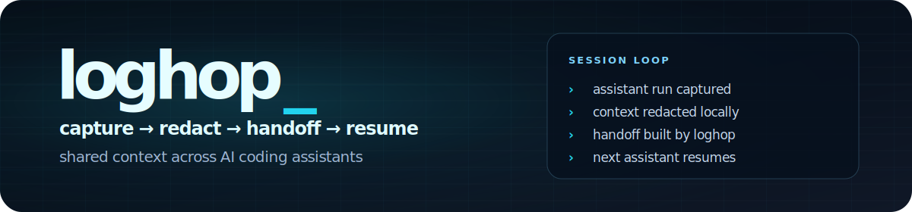
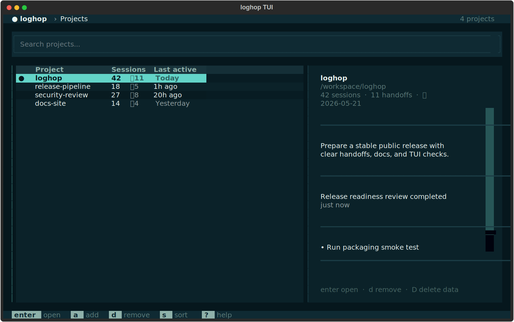

<p align="center">
  <a href="https://github.com/elruleh/loghop">
    
  </a>
</p>

<p align="center">
  <em>Switch AI coding assistants without starting over</em>
</p>

<p align="center">
<a href="https://pypi.org/project/loghop">
  
</a>
<a href="https://pypi.org/project/loghop">
  
</a>
<a href="https://github.com/elruleh/loghop/actions/workflows/ci.yml?query=branch%3Amain">
  
</a>
<a href="https://opensource.org/licenses/MIT">
  
</a>
</p>

<p align="center">
<a href="https://elruleh.github.io/loghop/">Docs</a> ·
<a href="#install">Install</a> ·
<a href="#quick-start">Quick start</a> ·
<a href="#commands">Commands</a> ·
<a href="#how-it-works">How it works</a> ·
<a href="#terminal-ui">Terminal UI</a> ·
<a href="#security">Security</a> ·
<a href="#contributing">Contributing</a>
</p>

---

Use **Claude Code** for a while. Switch to **Codex** later. Pick up where you left off.

loghop captures every session from your AI coding agents, builds a shared timeline,
and writes handoff context so the next run — even with a different provider — resumes
cleanly. No lost decisions, no repeated work, no copy-pasting summaries between terminals.

```text
┌─────────────────────────────────────────────────────────────────────────────┐
│                                                                             │
│   🤖 Session 1: Claude Code                                                 │
│   $ loghop run                                                              │
│   ┌──────────────────────────────────────────────────────────────┐          │
│   │ Working on task: "Setup Database schema"                     │          │
│   │ [Session complete - Autocapturing...]                        │          │
│   └──────────────────────────────┬───────────────────────────────┘          │
│                                  │                                          │
│                                  ▼                                          │
│                    📦 Unified Timeline (.loghop/)                           │
│     S-001.md: Claude Code session (Setup DB)                                │
│     H-001.md: Next steps (Add migrations & seeding)                          │
│                                  │                                          │
│                                  ▼                                          │
│   🧠 Session 2: Codex (OpenAI)                                              │
│   $ loghop run --provider codex                                             │
│   ┌──────────────────────────────────────────────────────────────┐          │
│   │ Handoff loaded: Resuming from Session 1 (Setup DB)           │          │
│   │ Current Goal: "Add migrations & seeding"                     │          │
│   └──────────────────────────────────────────────────────────────┘          │
│                                                                             │
└─────────────────────────────────────────────────────────────────────────────┘
```

<p align="center">
  
</p>

## Key features

- **Automatic session capture** — reads native transcripts from Claude Code and Codex, redacts secrets, stores them locally
- **Seamless handoffs** — builds context packets so the next provider knows what happened before
- **Shared timeline** — every session across every provider, in one `timeline.jsonl`
- **Terminal UI** — browse projects, sessions, and handoffs with Textual (4 built-in themes)
- **Zero-config providers** — Claude and Codex are auto-detected from `PATH`
- **Security-first** — all files `0600`, atomic writes, regex redaction of API keys/tokens/JWTs

## Install

Python 3.12+, Git, Linux/macOS. Windows is best-effort: the core CLI works, but a few optional hooks (POSIX PATH shim, `bash -c env -0` shell probe for Claude credentials) gracefully degrade or disable themselves on non-POSIX shells.

```bash
pipx install loghop
# or
uv tool install loghop
```

For the terminal UI (pulls in [Textual](https://github.com/Textualize/textual)):

```bash
pipx install 'loghop[tui]'
```

## Quick start

```bash
# Inside any Git repo:
loghop init              # one-time setup (hooks, shim, prompt — asks once)
loghop run               # start or resume a session
loghop goal "Ship auth"  # set a goal so the next run stays focused
```

That's it. Every `loghop run` now:

1. Builds a handoff from the project's timeline
2. Launches the provider (Claude or Codex)
3. Captures the transcript when it finishes
4. Appends the session to the shared timeline

## Commands

```
loghop init                                  set up in the current repo
loghop run [<project>] [--provider ...]      start or resume a session
loghop goal "<text>"                         set a default project goal
loghop sessions                              browse recorded provider runs
loghop topics                                group related sessions by work item
loghop timeline                              inspect shared work by day/provider
loghop projects                              list registered projects
loghop projects remove|purge                 unregister or purge a project
loghop doctor [--fix]                        check or repair install state
loghop health                                run project health checks
loghop metrics [--format <format>]           export project metrics (summary, prometheus, json, yaml)
loghop backup create|restore                 backup or restore local loghop data
loghop migrate [--dry-run]                   migrate local metadata schema
loghop tui                                   open the terminal UI
```

`--provider` is optional. If omitted, loghop picks the last-used provider for the
project — or the first one on `PATH`.

<details>
<summary>Full command reference</summary>

```bash
loghop install                               first-time global install
loghop uninstall [--purge] [-y]              remove loghop artifacts
loghop install-aliases                       install shell aliases in profiles
loghop uninstall-aliases                     uninstall shell aliases from profiles
loghop completion {bash,zsh,fish}            shell tab-completion
loghop providers                             list available providers

loghop handoff build|list|show               manage handoff documents
loghop resume [<project>] [--provider ...]   resume a previous session/topic
loghop topics list|show|switch|close|rename  manage work topics
loghop sessions show|annotate|reconcile      inspect and fix sessions
loghop projects show|remove|purge|cleanup    manage the project registry
loghop wrap {codex,claude} [provider args]   transparent provider wrapper
loghop journal [--since 7d] [--all]          session journal
loghop timeline [--since 12h] [--provider]   timeline view
loghop status                                project status overview
loghop health                                production-style health checks
loghop metrics [--format <format>]           export project metrics (summary, prometheus, json, yaml)
loghop backup create|restore                 backup or restore local loghop data
loghop migrate [--dry-run]                   migrate local metadata schema
```

Global flags: `--json`, `--plain`, `--quiet`, `--verbose`, `--version`, `--global`.

</details>

## How it works

```
┌─────────────┐     ┌─────────────┐     ┌─────────────┐
│  loghop run  │────▶│   Provider   │────▶│   Capture   │
│  build handoff│    │ Claude/Codex │    │  transcript  │
└─────────────┘     └─────────────┘     └──────┬──────┘
                                                │
                          ┌─────────────────────▼──────────────────────┐
                          │              .loghop/                       │
                          │  timeline.jsonl  ← shared across providers │
                          │  sessions/S-*.md ← redacted metadata       │
                          │  handoffs/H-*.md ← context for next run    │
                          └────────────────────────────────────────────┘
```

After each run, loghop reads the provider's native transcript
(`~/.claude/projects/...` for Claude, `~/.codex/sessions/...` for Codex),
redacts secrets, and stores it under `.loghop/sessions/`. The next `loghop run`
builds a handoff from the timeline so the provider gets full context.

### Integration layers

`loghop init` orchestrates optional integrations. Each answer is stored in
`~/.loghop/config.toml`. Re-running `init` is safe; installers are idempotent.

1. **Claude hooks** — merges `SessionStart` and `SessionEnd` commands into
   `~/.claude/settings.json`, preserving existing settings.
2. **Codex shim** — writes a managed executable in `~/.local/bin/codex` that
   delegates to `loghop wrap codex`. Refuses to overwrite non-loghop files.
3. **Prompt block** — writes `~/.loghop/loghop-prompt.md` and includes it from
   Codex `AGENTS.md` and Claude `CLAUDE.md`. Asks providers to emit a structured
   `loghop` block with summary, decisions, and todos.
4. **Fast-path parser** — when a captured transcript contains the fenced `loghop`
   block, autocapture trusts it for metadata before falling back to heuristics.

### Transparent capture

Add a shell alias so direct `claude`/`codex` calls go through loghop in
initialized repos. Outside a repo, the wrapper passes through to the real binary.

You can automatically install or remove these aliases in your shell profile configuration files (`~/.bashrc`, `~/.zshrc`, `~/.config/fish/config.fish`) using:

```bash
loghop install-aliases       # install the alias block
loghop uninstall-aliases     # remove the alias block
```

Or configure it manually:

```bash
alias claude='loghop wrap claude'
alias codex='loghop wrap codex'
```

### Cross-project usage

```bash
loghop run my-project                 # cd into registered project, then resume
loghop journal --since 7d             # last week of sessions in current repo
loghop journal --all --since 30d      # last month across all projects
```

## Terminal UI

When stdout is a terminal and Textual is installed, running `loghop` (no
arguments) opens an interactive TUI. Use `loghop tui` to open it explicitly.

```bash
pipx install 'loghop[tui]'
```

<p align="center">
  
</p>

- **Home screen** — global project list and status
- **Project screen** — sessions, handoffs, and timeline for one repo
- **Command palette** — press `m` to search and run commands
- **4 themes** — Classic dark/light, Harbor dark/light

## Storage layout

```text
.loghop/
  config.toml                    goal, handoff counter, session counter
  handoffs/
    H-001.md                     markdown with YAML frontmatter metadata
  topics/
    T-001.md                     work topic grouping related sessions
  timeline.jsonl                 canonical timeline across providers
  sessions/
    S-001.md                     session metadata (goal, topic, status, summary, todos)
    S-001.transcript.jsonl       redacted turns from the provider transcript
  .loghopignore                  patterns excluded from the handoff packet
loghop.md                        regenerated summary (goal + repo snapshot)

~/.loghop/projects.toml          global registry of all loghop projects
~/.loghop/config.toml            global init/install choices
~/.loghop/loghop-prompt.md       optional prompt include
```

`loghop init` adds both `loghop.md` and `.loghop/` to `.gitignore`.

## Providers

**Claude Code** and **Codex**. Auto-detected from `PATH` — no configuration
needed. Run `loghop providers` to see what's available.

## Exit codes

| Code | Meaning |
|---|---|
| 0 | success |
| 1 | unexpected internal error |
| 2 | usage / validation error |
| 3 | timeout |
| 10 | provider run exited non-zero |
| 20 | project not initialized |

## Security

- All files under `.loghop/` are written with mode `0o600` on POSIX; on Windows the same `0600`/`0700` intent is applied via `os.chmod` best-effort, but the OS may map these differently.
- Atomic writes via `tempfile.mkstemp` + `os.replace` + `fsync`.
- `loghop health`, `loghop metrics`, `loghop backup`, and `loghop migrate` support operational checks, observability, recovery, and schema upgrades.
- File reads reject symlinks; `.loghop/` paths are validated before use.
- Per-project lock on handoff creation prevents duplicate IDs under concurrent runs.
- Every handoff, transcript, and `loghop.md` passes through a regex redactor that
  strips API keys, bearer tokens, JWTs, and URLs with embedded credentials.
- Handoff and session artifacts include an HMAC signature over metadata and markdown body, backed by a private per-project `.loghop/integrity.key`.
- Capture survives interruption — `Ctrl+C`, rate-limit kills, and provider timeouts
  all trigger a `try/finally` that sweeps partial transcripts. Sessions left as
  `running` for over 1 hour are auto-finalized on the next invocation; explicit
  recovery via `loghop sessions reconcile`.

## Built with

- [Rich](https://github.com/Textualize/rich) — terminal formatting
- [Textual](https://github.com/Textualize/textual) — terminal UI framework
- [PyYAML](https://github.com/yaml/pyyaml) — frontmatter and config parsing

## Contributing

Contributions are welcome! See [CONTRIBUTING.md](CONTRIBUTING.md) for development
setup, coding standards, and the release process. For documentation, see the [docs
folder](docs/).

```bash
git clone https://github.com/elruleh/loghop.git
cd loghop
uv sync --all-extras --dev
bash scripts/release_check.sh qa
python3 scripts/e2e_user_flow.py --skip-pytest --skip-smoke
```

## License

[MIT](LICENSE) — use it however you like.

## Disclaimer

Loghop is not affiliated with, endorsed by, or connected to Anthropic or OpenAI.

---

<p align="center">
  <a href="https://github.com/elruleh/loghop/issues/new/choose">Report a bug</a> ·
  <a href="https://github.com/elruleh/loghop/issues/new/choose">Request a feature</a>
</p>
